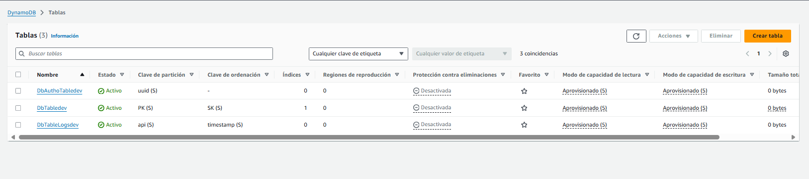

## NoSQL Workbech
    - Este servicio lo instale para tener una interfaz grafica de como se veria mi tabla de dynamo local
    https://docs.aws.amazon.com/amazondynamodb/latest/developerguide/workbench.settingup.html

## Correr proyecto local

- Instalar sam cli
    - https://docs.aws.amazon.com/es_es/serverless-application-model/latest/developerguide/install-sam-cli.html

- Comandos a correr Makefile creacion de dynamo y tablas local
    - make up
    - Crear entorno virtual
        - virtualenv venv
    - Activar entorno virtual
        - source ./venv/bin/activate
    - Instalar librerias en ese entorno
        - pip install -r local.txt
    - make create-tables-dynamo

- Correr proyecto con sam
    - make sam-build
    - make sam-local

## Consideraciones

- El .env es el que toma las variables de entorno en para python como tal (el cual se encuentra aca shared/constants.py ) y en parameters.json son parametros de los template de cloudformation

## Deploy local


- list profiles local
    - cat ~/.aws/credentials

  The first time it is deployed it should be run with **sam deploy --guided --profile MY_PROFILE**
  ```bash
  $ sam build --use-container && sam deploy --config-env develop|staging|production && rm -rf .aws-sam
  $ sam deploy --profile YOUR_PROFILE --config-env develop


# Deploy

sam deploy --guided --profile pheno
sam build --use-container
sam deploy --profile pheno --config-env develop

## Evidencias stack desplegado

- Aws Images deploy
    - Api gateway rest deploy evidence 
        - 
    - Dynamo table deploy evidence 
        - 
    - Cloudformation deploy evidence 
        - 
    - Lambdas deploy evidence 
        - 
    - Layer deploy evidence 
        - 

- Test Api gateway y lambdas
    - Create company
        - 
    - Create User
        - 
    - Login User
        - 
    - Create company
        - 

- Table data dynamo records
    - Table data
        - 

## Local

- local sam
    - 

- local docker compose
    - 

- Tables dynamo local UI
    - 